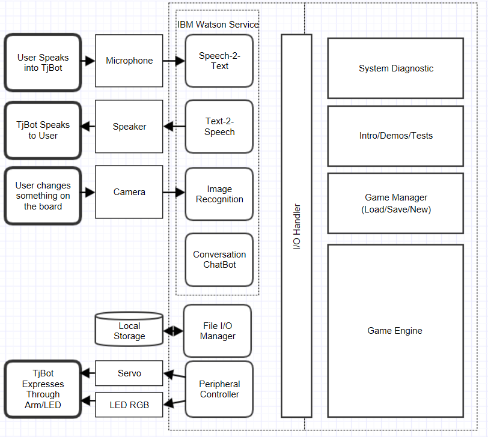

# MakeHackathon 2018 FAU

## Team Orientation

Connected to GitHub (2/16/2018)

## Objective

Hackathon Objective: Use the TJ-Bot from IBM and the IBM Watson Webservices to build out a clever product. 

> Big Idea : A TjBot Game I can play with my freinds.

Ideal State : 
1. A playable game that is curated by TjBot
2. Multiplayer
3. Accessories such as figurines, and a game board/ cards.
4. Dynamically changing game diffuculty
5. Simple and Intuitive
6. Adjustable Scenarios / Puzzle / Adventure /Action

## Product Scope
Lets narrow the scope of the ideal state by creating a matrix that will scale our requirements. I created a few catagories. Difficulty refers to how hard it is the implement the feature. GamePlay is the value added to the game. Hackage is the measurement of how well the feature shows the abilities of the TjBot and the usage of the Watson Services. The scale for difficulty is (1-10) . I added the hackage and gameplay categories then subtracted the difficutly to get a "weight". 
The top weighted features are the ones we should focus on.

| Features                     | Difficulty | Hackage | GamePlay | Total |
|------------------------------|------------|---------|----------|-------|
| Led indicator                | 5          | 10      | 8        | 13    |
| NPC   Chatbots               | 7          | 10      | 8        | 11    |
| Store Game Context           | 6          | 8       | 9        | 11    |
| Multiplayer                  | 10         | 10      | 10       | 10    |
| NLP user input               | 7          | 10      | 7        | 10    |
| Scripted Game                | 3          | 6       | 7        | 10    |
| TjBot Personality            | 8          | 10      | 7        | 9     |
| Board w/ Image   Recognition | 10         | 10      | 8        | 8     |
| Dynamic Game Difficulty      | 10         | 8       | 10       | 8     |
| Procedural Game              | 9          | 7       | 10       | 8     |
| Game for all ages            | 7          | 4       | 10       | 7     |
| Incorporate   arm movment    | 7          | 7       | 6        | 6     |
| Many Campaigns               | 10         | 4       | 10       | 4     |
| Accesories                   | 2          | 4       | 2        | 4     |
| Detect player emotion        | 9          | 9       | 2        | 2     |


## Requirements

By analayzing our matrix we can pick the top features that are the best to focus the product scope on. On closer inspection these do seem like the most important tasks to work on in the beginning. 

### Design Goals
* Led indicator
* NPC Chatbots
* Store Game Context
* Multiplayer
* NLP user input
* Scripted Game

Using the design goals we can start to draft a game plan that could help us acheive the goals. We can start by breaking down what these goals are trying to achieve as use cases :

### Use Case : Scripted Game Scenario 
1. Multiple people want to play a game with TjBot. 
2. TjBot starts up and initiates a conversation to start a new game or load a previous one.
3. The game begins by following a script and asking the players to perform actions.
4. Players ask Tjbot for help on possible actions and it response with information in the game but also as an AI. 
5. When players want to interact with characters in the game the LED of tjbot changes indicating that its no longer the narrator but a character in the game. 
6. Players interview NPC's for answers to solve the puzzles or finish the scripted adventure.
7. Completed objectives, Scores,Equipment, Player names are all stored for the next time a game starts.

The use case allows us to envision an overall outline of what the product cant acheive. We can start to break down functional components of the design with these expectations. 

### Process Flow

#### General Gameplay :

1. Supplier : Human Player (Requests Game Start)
2. Start TjBot
4. Start New Game or Load Game
    - New Game -> Request Game Settings
    - Load Game -> Read local storage and get Game Settings
5. Load Game State 
6. TjBot Narrates A Game State Objective
7. TjBot Waits for any player
8. Player requests to perform action 
9. TjBot Interprets Requests using NLP
    - Valid Request -> Change Game State & Jump to '5'
    - Invalid Request -> Ask for clarification & jump to '6'

#### General Game State-Machine

Lets create a very high-level flowchart of the statemachine that can run our process. I define the game script as the story that we will have to build. This would be the overall direction of the game. The script will contain several _objectives_ , The objectives are like tiny scenes that force the player to complete it by answering correctly or requesting to change something in the game state. The _game state_ , is the state of all the variables in the game. We can hold a series of variables in memory at the start of the game. 

1. System Start
2. Load Game Script
2. Loop:
    1. Load Game Context
    2. Load "Uncompleted" Objectives from Script
    4. Choose (Next) Objective
    6. Loop :
        1. Change game context variables
        2. Update game objective w/ game context 
        2. Narrate game objective
        1. Player Requests to change context variables : go to 1
        2. Player Requests more info on objective : go to 2
        3. Game objective complete : exit loop 
    5. Update Objective to "Completed"  in Game Context 

#### Psuedo Code

An objective for the game could be seen as a JSON object. The data it holds can be used to describe the scene to the player and then if more information is needed the player can request an inventory of the items in the scene.

```javascript

var objective = {
        "Name":"Escape the Room",
        "Description" :"You are in a very small room. I suggest you leave.",
        "Scene":
				[
					{ "obj": "Door", "dtl": "The door is flimsy."},
				]
}
        
```

If we could create a way for the users to interact with the "scene" in a calcualted way then it would be more of a structured game than just guessing what they will ask to do. So i would suggest using what most game systems do , create a character stat sheet and give the character limited actions to use when interacting with its world. 

```javascript

var player = {
    "Name":"Bob",
    "Health":100,
    "Strength":10,
    "Speed":3,
    "Actions" : [
        "Punch", "Kick", "Grab","Investigate","Touch","Run Away" // we can add more..
    ]
}

```
With a structured player object we can now structure the scenes to have items that can interact with the same structure. What if we create _events_ that can occur based on specific conditions. In the world we are creating i would try to break it down into 3 simplistic action types. 

1. Passive interaction  , p
    - Open a door or window
    - Pickup an item
    - Lay down on Bed
2. Kinetic interaction  , k
    - Kick down the door
    - Swing a sword
    - Sneak into the room
3. information query , q
    - Look around the corner
    - Read the note
    - Listen closer

I can use the p,k,q action types along with ha similar definition that can be used for generic object types. Objects in the world could also be sorted very simplistically. 

1. Soft Objects , s
2. Hard objects ,h
3. Informative Object, i

The p,k,q and the s,h,i categories are ways to define objects and actions. Every action can have a certain amount of each of the p,k,q, components. Similarly the s,h,i  compoments can be used to describe an object. 
The objects with certain amount of softness should be more accessible with passive interactions than kinetic interactions. Objects with more hardness should be effected more by the kinetic interactions. Objects with lots of information should be very susceptible to actions that are inquisitive. 

Lets create a "object type" vector `OT` and a "action type" vector, `AT`. 

```javascript

//Object Types
var OT = {
    "s":0.1, //soft
    "h":0.1, //hard
    "i":0.1, //info
}

//Action Types
var AT = {
    "p":0.1,//passive
    "k":0.1,//kinetic
    "q":0.1,//query
}

```

So now that the objects have a structure, what can we do with that? Well we can try to use the structure to define a particular outcome or event from the structure. Each action acting on an object is seeking to trigger an event of somekind. The events are consequences of what happens when an action interacts with an object. So we can create a formula for the event outcome . The event outcome would then be a vector of three choices. Lets also add an amount of randomness to the mix with a Noise() vector, and a player stat vector that will augment or hinder the success of an action based on the previous game outcomes. The E vector can then be normalized to 1 and used to choose the event option in the list according to the index that is equal to 1. 


`E= AT * OT * Noise() * Bonus() * Effects() `

```javascript

//Expectation list for the given object
var E = {
    {"event":"The item has opened","result":"exit"},//sp
    {"event":"The item explodes","result":"damage"},//hk
    {"event":"The item has scratches","result":""},//iq
}

```

So for every object in the scene i would need to create a OT and an E vector with object type information and Expected outcomes of the object. For every player's actions i would need to create a AT vector. The actions from the player would come from the game states input. The bonus and effects vectors could come from the players game state as well. The noise vector can be generated at the time the Expected state is going to be chosen. 

The results of the E vector , are used as reserved results that can be sent back to the game engine. It can determine if the objective is completed or if there is something else that needs to be done.  

```javascript
function OnRequest(Requested) {

    //get the player in the party 
    var player = Game.Party[Requested.player];
    // todo : check if player exists

    //get the request from player
    var act = player.Actions[Requested.action];
    // todo : check if action is valid

    var obj = Game.getObject(Requested.object);
    // todo : check if object is valid in the scene

    //get the outcome of the action on the object
    out = Outcome(act,obj,player);
    // Narrate the event that occurred
    tjbot.Speak(out.event)
    // Update based on events result
    Game.Update(out.result,obj,act,player)

    //a:Action, o:Object, p:Player
    function Outcome(a,o,p){
        arr = normalize(a*o*p.noise(a)*p.effects(a)*p.bonus(a));
        i = nonzero_indices(arr);
        return o.E[i];
    }
}
```

I use a class that i havent defined yet , "Game". By creating the functional pieces i saw a need for an overall game class that cna hold the current objective with its scene and objects. I would access the game class directly to pull back the latest stats and then use the Update method to provide a result a in the game and allow the game class to handle what should happen.

Lets try to define the game class

```javascript

var Game = {
    Party : null, // Players
    Objective : null, // from json dataset
    Create : function(party){
        var obj = Object.create(this);
        obj.Party = party;
        obj.Objective = this.GetObjective();
    },
    GetObjective : function(){
        //search through local json dataset 
        //for objective that is not completed
    }
    GetObject : function (obj){
        //find the object in 
        return this.Objective.Scene[obj];
    }
    HideObject : function (obj){
        //remove the object 
        return this.Objective.Scene[obj].pop();
    }
    Update : function(result,obj,act,player){
        switch(result){
           case "exit" : this.Objective.exit();break;
           case "damage" : this.Party[player].TakeDamage(obj); break;
           case "hide" : this.HideObject(obj); break;
           case "activate" : this.Objective.activate(obj); break;
        }
    }
}

```


#### Multiplayer

To create multiple players a player class can be instantiated for each. We established that each player requires special stats. Upon creation of a new player those stats can be created and a verbal description can be provided.
The players can be distinguished by having each player have thier own name. The players can say the "name" of the character before the request to indicate wich player to use when calculating the event. The tjbot can also repeat the player names and thier description if someone forgets who is in the party. 


### Preliminary Software Design

JSON DataSets :

1. Player Actions {name,{p,k,q}}
2. Objects {name,{s,h,i},E[]}
3. Objectives {name,desc,objects[]}

Game State Software Diagram :


# Software Design

The initial work focused on defining the scope and sketching out the most useful features given the technology we want to use. This software design section is to break out the requirements and the initial sketches in a more controlled way. I want to really flesh out the inputs and outputs of the system at a very high level. Then I will dive deeper and deeper at each section.
The final design will have the features broken down into functional sections that can be tested individually. 


Lets highlight the IO functionality that will need to be tested in order to verify the system at this level. In the image below we see the division more clearly in terms of functionality. I created hardware and software distinctions and was able to see the use of a I/O handler layer. 



On the other side of the IO Handler is the Game engine and some other useful software modules. The modules are 

* System Diagnostic : An initial software module that will be used to boot up the tjbot and assume any diagnostic tests of the hardware. Such as Unit Tests. This will be the layer we can build on while the other software modules are bieng developed. 

* Standby Mode (Intro/Demo/Tests) : module will house all the higher level testing. We can build out small demos to test more end-to-end outputs of the system. This could also house the "introduction" mode for the tjbot before it starts to curate a game. 

* Game Manager : The running game needs a way to startup and a way to be monitored. This module will contain all the needed data processing and storing of the data for handling new games, or loading old ones. We would also handle unuexpected game conditions here as a last resort.

* Game Engine : All the magic happens here. Once complete the game engine will have rules to process the game variables and generate new information to be passed on to the user. 

## I/O Handler

High Level Psuedo code that shows all the I/O handler methods required to support the system inputs and outputs as described above. 


```Javascript
//------------------------------
// IO Handler
//------------------------------

var rpio = require('rpio'),
var watson = require('watson-developer-cloud'),
var exec = require('child_process').execSync,

//IBM BlueMix Authentication 
var fs = require('fs');
var config = JSON.parse(fs.readFileSync('bluemix_auth.json','utf8'));

//IBM Watson - Speech to Text Service
var Ispeech_to_text = {
    //...
}
modules.export = Ispeech_to_text;


//IBM Watson - Text to Speech Service
var Itext_to_speech = {
    //...
}
modules.export = Itext_to_speech;


//IBM Watson - Conversation Service
var Iconversation = {
    //...
}
modules.export = Iconversation;


//Local File IO 
var Ifileio = {
    //...
}
modules.export = Ifileio;

//LED RGB 
var Iled ={
    //..
}
modules.export = Iled;

//Arm Servo 
var Iarm ={
    //..
}
modules.export = Iarm;

```

# Game Engine

What would be the game state? We could simplify our game interaction to something similar to original text dungeon games.
This would only take a small game state for the player to think about and a definit map to play again and again. 

1. Load A Room
2. Explain the Room to the player
3. Get player action
4. Process player action
5. If action not understood ask player to try again.
6. If action is understood
    1. Update game variables with action
    2. If variables meet roomm conditions, go to 7
    3. If variables do not meet room conditions , Explain state of room & go to 3
7. End room 
    1.explain room is completed
    2.ask direction to continue (N,E,S,W). 
8. Go To 1


## What the Rooms are Made Of?

Each room can contain different things. To make the game fun lets imagine some options:

1. Treasure
2. Monster
3. NPC,Riddle
4. Key.. or map.. etc. 

Lets create a "functionality" for each of these events. Can they be done in a fun and interesting way, but still keep the programming to a minimal?

Treasure : We would need to keep an inventory of collected values. Lets keep a running inventory of "money" this way we can use NPC's that provide equipment based on money they can offer. Keeping a system of money in the game can create an illusion of role playing and add a bit more variability to the game. 

Items : Items can be things that the user can choose to equip. For simplicity we can make this a single item at a time. When one item is equipped it can add to the attack and defense of the player. We would also like to have teh DM tell the stats of the item.